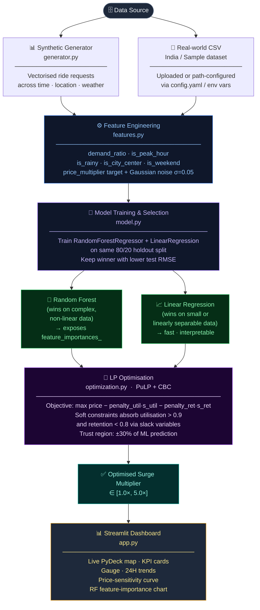

# 🚖 AI-Driven Dynamic Pricing System

A production-grade, AI-powered dynamic pricing engine that adjusts ride-sharing fares in real-time based on demand, supply, weather, and contextual factors. The system combines an **Random Forest Regressor** (with a Linear Regression baseline) for revenue-optimised fare adjustment.

## 🚀 Features

- **Real-time Simulation** – Vectorised synthetic ride-request generation across time, location, and weather dimensions.
- **AI Price Prediction** – A **Random Forest Regressor** (with a Linear Regression baseline) predicts the optimal surge multiplier from engineered features. Both models are trained on every run; the one with the lower test RMSE is used for inference.
- **Soft-Constraint Optimisation** – A **Linear Program (PuLP + CBC)** refines the ML prediction while penalising violations of driver-utilisation and customer-retention targets via slack variables — never causing solver infeasibility.
- **Decoupled Architecture** – UI (`app.py`), data access (`data_access.py`), feature engineering (`features.py`), model (`model.py`), and optimisation (`optimization.py`) are strictly separated concerns.
- **Configuration-Driven** – Fallback coordinates, data paths, and LP penalty weights are managed in `config.yaml` and overridable via environment variables — no magic numbers in source code.
- **Interactive Dashboard** – Premium **Streamlit** UI with:
  - Live PyDeck scatter-map of ride demand.
  - Real-time KPI metrics (Demand Ratio, Utilisation, Predicted Surge, Optimised Surge).
  - Gauge chart, 24H trend lines, price-sensitivity curve, and RF feature-importance chart (shown when Random Forest wins the RMSE comparison).
- **Dual Data Mode** – Train on **Synthetic Data** (generated on-the-fly) or **Real-world CSV** (India market data or generic sample).
- **Container-Ready** – Docker + Docker Compose with `PYTHONUNBUFFERED=1` for real-time log streaming.

## 🛠️ Tech Stack

| Layer | Technology |
|---|---|
| Language | Python 3.10+ |
| Dashboard | Streamlit |
| Machine Learning | scikit-learn (RandomForestRegressor, LinearRegression) |
| Optimisation | PuLP (LP, CBC solver) |
| Data Processing | Pandas, NumPy |
| Visualisation | Plotly, PyDeck |
| Configuration | PyYAML |
| Containerisation | Docker, Docker Compose |

## 📦 Installation

### Option 1: Docker (Recommended)

```bash
git clone https://github.com/yourusername/dynamic-pricing-system.git
cd dynamic-pricing-system
docker compose up --build
```

The app will be available at `http://localhost:8501`.

### Option 2: Local Setup

```bash
python3 -m venv .venv
source .venv/bin/activate          # Windows: .venv\Scripts\activate
pip install -r requirements.txt
streamlit run src/app.py
```

## ⚙️ Configuration

All tuneable values live in [`config.yaml`](config.yaml) at the project root.

| config.yaml key | Env variable override | Default | Description |
|---|---|---|---|
| `default_lat` | `PRICING_DEFAULT_LAT` | `28.6` | Map fallback latitude |
| `default_lon` | `PRICING_DEFAULT_LON` | `77.2` | Map fallback longitude |
| `data_paths.india_csv` | `PRICING_INDIA_CSV_PATH` | `data/india_ride_data.csv` | India dataset path |
| `data_paths.sample_csv` | `PRICING_SAMPLE_CSV_PATH` | `data/sample_ride_data.csv` | Sample dataset path |
| `optimization.penalty_utilization` | – | `10.0` | LP penalty for utilisation violations |
| `optimization.penalty_retention` | – | `8.0` | LP penalty for retention violations |
| `location_fallbacks.*` | – | Delhi area coords | Coordinate imputation map |

Environment variables take precedence over `config.yaml` values; set them in `docker-compose.yml` or your shell.

## 📂 Project Structure

```
dynamic-pricing-system/
├── config.yaml             # Central configuration (data paths, coords, LP weights)
├── data/                   # CSV data files
│   ├── india_ride_data.csv
│   └── sample_ride_data.csv
├── docs/
│   ├── SYSTEM_ARCHITECTURE.txt
│   └── technical_reference.md
├── scripts/
│   └── generate_data.py    # CLI data-generation utility
├── src/
│   ├── app.py              # Streamlit UI only – no business logic
│   ├── data_access.py      # Config loading, CSV resolution, coord imputation, filtering
│   ├── features.py         # Feature engineering + stochastic target generation
│   ├── generator.py        # Vectorised synthetic data generator
│   ├── model.py            # RF/LR training, best-of-two RMSE selection, inference, persistence
│   └── optimization.py     # Soft-constraint LP optimisation
├── tests/
├── Dockerfile
├── docker-compose.yml
└── requirements.txt
```

## 🧠 How It Works

1. **Data Generation** – `generator.py` simulates ride requests with correlated time, location, weather, and event attributes.
2. **Feature Engineering** – `features.py` derives `demand_ratio`, `is_peak_hour`, `is_rainy`, `is_city_center`, and `is_weekend`. The `price_multiplier` target variable is the deterministic business rule **plus Gaussian noise** (σ = 0.05) to prevent memorisation.
3. **ML Prediction** – `model.py` trains a **Random Forest Regressor** and a **Linear Regression** baseline. The lower-RMSE model on the 80/20 holdout split is selected as the winner and persisted as `.joblib`.
4. **Soft-Constraint Optimisation** – `optimization.py` runs a Linear Program:
   - **Objective**: Maximise `price − (10 × slack_util) − (8 × slack_ret)`
   - **Soft constraints**: Slack variables absorb utilisation > 0.9 and retention < 0.8 violations with a cost instead of making the LP infeasible.
   - **Hard constraint**: Trust region (±30% of ML prediction) – always satisfiable.
5. **Data Access** – `data_access.py` loads `config.yaml`, resolves CSV paths, imputes missing coordinates, and filters DataFrames. Zero business logic in `app.py`.
6. **Visualisation** – `app.py` renders the final price and all insights via Streamlit.

## 🗺️ Architecture Diagram

The diagram below shows the end-to-end data flow — from raw simulation all the
way through to the Streamlit dashboard that a pricing ops team sees.



## 📄 License

MIT License.